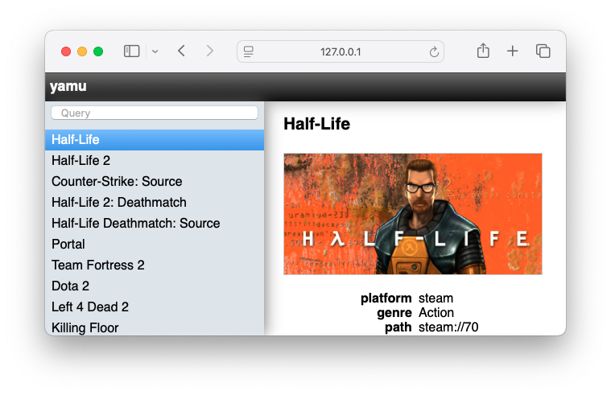

Web
===

The ``web`` plugin provides a lightweight browser UI for your library.

Enable it in your config:

::

    plugins:
      - web
    web:
      host: "127.0.0.1"
      port: 8337

Run the server:

::

    yamu web

The UI displays game metadata, artwork (via ``fetchart``), completion status,
and achievements (if fetched).
